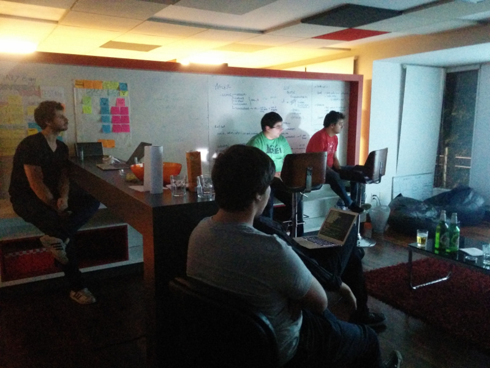

# Junio 2015

* Fecha: 11 de Junio del 2015
* Hora: 19:30 a 23:00 hrs
* Participantes: 8

## Descripción

En el meetup realizamos dos actividades.

La primera actividad consistió en aprender como crear un Addon de `ember-cli`
desde cero hasta su publicación en el repositorio NPM.

Para la segunda actividad creamos un Pull Request para el proyecto open source
`ember-cli-page-object` con el cuál aprendimos a crear generadores (blueprints)
de ember-cli.

Ambas actividades fueron presentadas por Santiago.

## Recursos

* Notas de la actividad [¿Cómo crear un addon para ember-cli?](./ember-cli-addon.md) por Santiago
* Notas de la actividad [Agregar generadores a ember-cli-page-object](./add-generators.md) por Santiago
* [Código del addon que se construyó](https://github.com/ember-montevideo/ember-cli-scroll-to-here)
* [Link al Pull request que se creó](https://github.com/san650/ember-cli-page-object/pull/27)

## Participantes

* Adrián Mugnolo ([@xymbol](https://github.com/xymbol))
* Daniel Gomez ([@eldano](https://github.com/eldano))
* Gustavo Villa ([@gfvcastro](https://github.com/gfvcastro))
* Juan Azambuja ([@juanazam](https://github.com/juanazam))
* Juan Carlos Quintero ([@juancarlosqr](https://github.com/juancarlosqr))
* Mauricio Mena ([@lvlauricio](https://github.com/lvl4ul2i))
* Nicolás Barrera ([@drummerhead](https://github.com/drummerhead))
* Santiago Ferreira ([@san650](https://github.com/san650))

## Agradecimiento

Agradecemos a [WyeWorks](https://wyeworks.com/) por brindarnos el lugar e
invitarnos las bebidas, los snacks y la cena.
