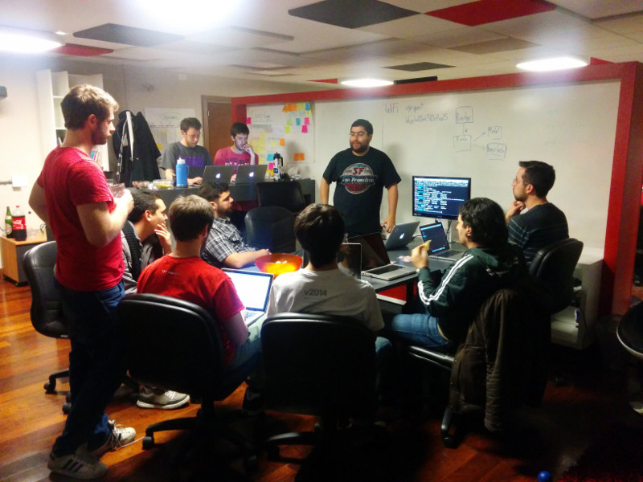

# Julio 2015

* Fecha: 9 de Julio del 2015
* Hora: 19:30 a 23:00 hrs
* Participantes: 11

## Descripción

La idea fue tener tres actividades en paralelo:
* [Ember desde 0](./ember-desde-0.md)
* Animaciones con [Liquid Fire](http://ef4.github.io/liquid-fire/)
* Ember y [Electron](http://electron.atom.io/)

## Recursos

* Aplicación construida durante el meetup [reading-list](https://github.com/ember-montevideo/reading-list)
* [Proyecto `ten`](https://github.com/san650/ten): Learn how to build web applications by doing
* [Liquid Fire](http://ef4.github.io/liquid-fire/) Animaciones para Ember
* Proyecto [Electron](http://electron.atom.io/)
* Proyecto [ember-electron](https://github.com/usecanvas/ember-electron)

## Participantes

* Daniel Gomez ([@eldano](https://github.com/eldano))
* Diego Acosta ([@acostami](https://github.com/acostami))
* Juan Azambuja ([@juanazam](https://github.com/juanazam))
* Juan Carlos Quintero ([@juancarlosqr](https://github.com/juancarlosqr))
* Marcelo Dominguez ([@marpo60](@https://github.com/marpo60))
* Marcelo Ramos ([@marcelor](https://github.com/marcelor))
* Marcos Bellucci ([@delbetu](https://github.com/delbetu))
* Mauricio Mena ([@lvlauricio](https://github.com/lvl4ul2i))
* Nicolás Barrera ([@drummerhead](https://github.com/drummerhead))
* Santiago Bartesaghi ([@santib](https://github.com/santib))
* Santiago Ferreira ([@san650](https://github.com/san650))
