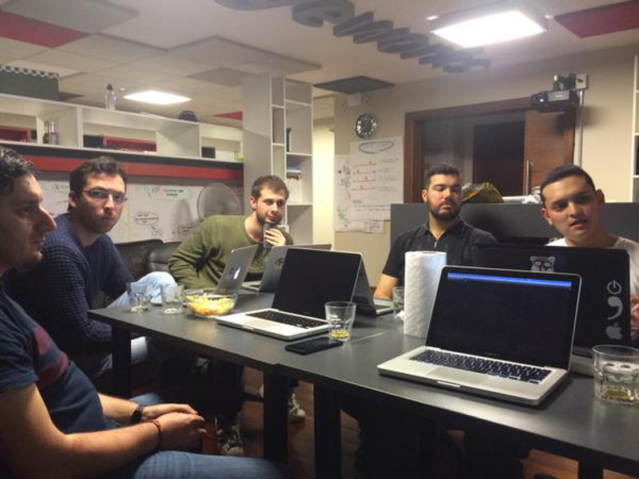

# Agosto 2015

* Fecha: 13 de Agosto del 2015
* Hora: 19:30 a 22:00 hrs
* Participantes: 6

## Descripción

La idea fue continuar con algunas actividades y comenzar a ver temas nuesvos:
* [ember-simple-auth](https://github.com/simplabs/ember-simple-auth) y
  [ember-torii](https://github.com/vestorly/torii) - Juan Carlos
* Ember desde 0: continuamos con la aplicación
  [reading-list](https://github.com/ember-montevideo/reading-list/blob/e9e9c126b943cf414e6ab2849bafa5e21592a940/README.md#ember-data)
  agregando ember-data al proyecto - Santiago

## Recursos

* [ember-simple-auth](https://github.com/simplabs/ember-simple-auth) a set of
  clean abstractions for authentication in Ember.js.
* [ember-torii](https://github.com/vestorly/torii) a lightweight library for
  implementing authentication/ authorization with Ember.js applications.
* Aplicación construida durante el meetup
  [reading-list](https://github.com/ember-montevideo/reading-list)
* Aplicación para utilizar como API de reading-list
  [reading-list-api](https://github.com/ember-montevideo/reading-list-api)
* [Proyecto `ten`](https://github.com/san650/ten): Learn how to build web
  applications by doing

## Participantes

* Juan Azambuja ([@juanazam](https://github.com/juanazam))
* Juan Carlos Quintero ([@juancarlosqr](https://github.com/juancarlosqr))
* Marcelo Ramos ([@marcelor](https://github.com/marcelor))
* Mauricio Mena ([@lvlauricio](https://github.com/lvl4ul2i))
* Nicolás Barrera ([@drummerhead](https://github.com/drummerhead))
* Santiago Ferreira ([@san650](https://github.com/san650))

## Agradecimientos

Agradecemos a [WyeWorks](https://wyeworks.com/) por brindarnos el lugar e
invitarnos las bebidas, los snacks y la cena.
