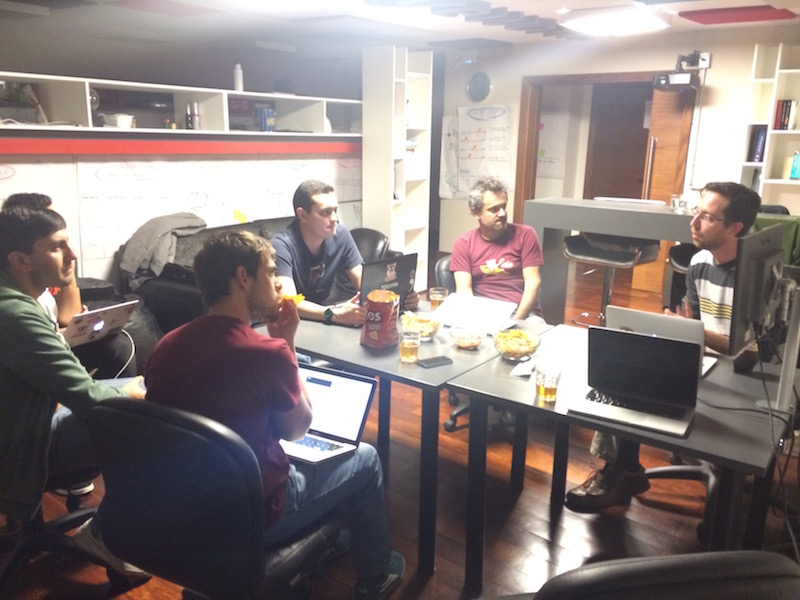

# Septiembre 2015

* Fecha: 10 de Septiembre del 2015
* Hora: 19:30 a 22:00 hrs
* Participantes: 7

## Descripción

La idea fue mirar algunos ejemplos de aplicaciones y profundizar en algún tema

* Miramos [ember-league](https://github.com/lvl4ul2i/ember-league) una aplicación de resultados de partidos de fútbol construida por
  Mauricio - Mauricio
* Miramos un ejemplo de como integrar WikiData creando un adaptador y
  serializador en
  reading-list [(branch)](https://github.com/ember-montevideo/reading-list/tree/wikidata) - Santiago
* Hicimos un servicio (Ember.Service) de ejemplo para reading-list - Adrián y
  Santiago

## Recursos

* [ember-league](https://github.com/lvl4ul2i/ember-league)
* [Ember.Service](http://guides.emberjs.com/v2.0.0/services/)
* Aplicación construida durante el meetup
  [reading-list](https://github.com/ember-montevideo/reading-list)
* Aplicación para utilizar como API de reading-list
  [reading-list-api](https://github.com/ember-montevideo/reading-list-api)
* [Branch](https://github.com/ember-montevideo/reading-list/tree/wikidata) de
  reading-list con ejemplo de WikiData
* [WikiData](https://www.wikidata.org/wiki/Wikidata:Main_Page)
* [WikiData API](https://www.wikidata.org/w/api.php)

## Participantes

* Adrián Mugnolo ([@xymbol](https://github.com/xymbol))
* Jorge Bejar ([@jmbejar](https://github.com/jmbejar))
* Juan Carlos Quintero ([@juancarlosqr](https://github.com/juancarlosqr))
* Marcos Bellucci ([@delbetu](https://github.com/delbetu))
* Mauricio Mena ([@lvlauricio](https://github.com/lvl4ul2i))
* Nicolás Barrera ([@drummerhead](https://github.com/drummerhead))
* Santiago Ferreira ([@san650](https://github.com/san650))
