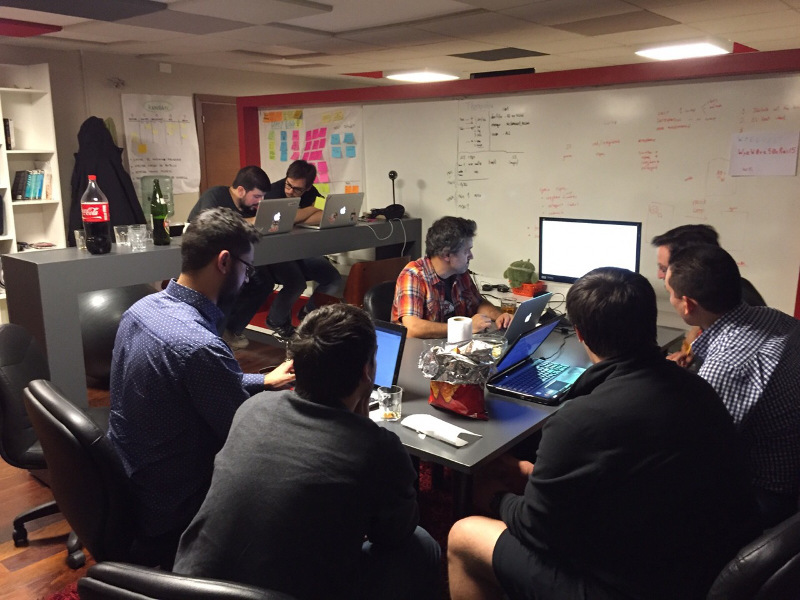

# Octubre de 2015

* Fecha: 8 de octubre de 2015
* Hora: de 19:30 a 22:00
* Participantes: 10

## Actividades propuestas

### Crear un clon de Spotify

En base a los materiales de un [proyecto similar con
Angular](https://github.com/iranreyes/spotyngular) nos proponemos, a lo largo de
varias reuniones y entre los asistentes, desarrollar un cliente
[Spotify](https://www.spotify.com/uy/) usando Ember. La intención es aplicar la
mayor cantidad de conceptos nuevos de Ember y Ember Data.

### Ember desde casi cero

Vení a aprender Ember con nosotros, tenemos
[algunas](https://github.com/ember-montevideo/reading-list)
[aplicaciones](https://github.com/ember-montevideo/movie-manager) de ejemplo con
las que podés arrancar. Los requisitos son mínimos: algún conocimiento sobre
desarrollo web y un nivel principiante de JavaScript.

## Recursos

* [5 Essential Ember 2.0 Concepts You Must Understand](http://emberigniter.com/5-essential-ember-2.0-concepts/)
* [Routable Components](https://github.com/ef4/rfcs/blob/routeable-components/active/0000-routeable-components.md)
* [Test-Driving Ember.js Models](https://semaphoreci.com/community/tutorials/test-driving-ember-js-models)
* [Using Canary Build Instead of Release](http://www.ember-cli.com/user-guide/#using-canary-build-instead-of-release)
* [10 Steps for Ramping into Ember.js Quickly](http://spin.atomicobject.com/2015/08/24/learn-ember-js-quickly/)

## Participantes

* Adrián Mugnolo ([@xymbol](https://github.com/xymbol))
* Daniel Gomez ([@eldano](https://github.com/eldano))
* Gustavo Villa ([@gfvcastro](https://github.com/gfvcastro))
* Jorge Bejar ([@jmbejar](https://github.com/jmbejar))
* Juan Carlos Quintero ([@juancarlosqr](https://github.com/juancarlosqr))
* Marcos Bellucci ([@delbetu](https://github.com/delbetu))
* Mauricio Mena ([@lvlauricio](https://github.com/lvl4ul2i))
* Nicolás Barrera ([@drummerhead](https://github.com/drummerhead))
* XXXX

## Agradecimientos

Agradecemos a la gente del meetup de [Angular
Montevideo](http://www.meetup.com/Angular-MVD/) y en especial a Irán Reyes
Fleitas que nos compartieron materiales (HTML, CSS, imágenes y tipografías) para
una de las actividades. Por si están interesados, Irán tiene un [proyecto
similar](https://github.com/iranreyes/spotyngular) con Angular.

Agradecemos a [WyeWorks](https://wyeworks.com/) por brindarnos el lugar e
invitarnos las bebidas, los snacks y la cena.
