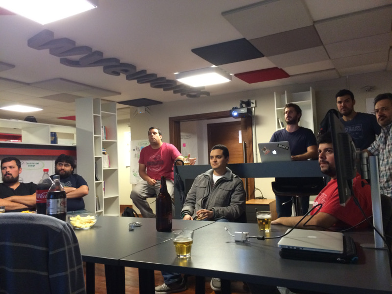

# Noviembre de 2015

* Fecha: 19 de noviembre de 2015
* Hora: de 19:30 a 22:00
* Participantes: 10

## Actividades

### Charla sobre el patrón Page Object

Juan Azambuja nos contó sobre el patrón de diseños Page Objects, ejemplos y
addons que nos pueden simplificar el trabajo.

### Test mocks

Adrián nos contó cómo crear fixtures y factories para nuestros tests con
http-mock, ember-cli-mirage y jquery-mockjax.

### datafarming.net

Álvaro nos mostró una aplicación real construida con Ember la cuál presentó
varios desafíos interesantes.

## Recursos

* [http-mock](http://ember-cli.com/user-guide/#mocks-and-fixtures)
* [ember-cli-mirage](http://www.ember-cli-mirage.com/)
* [jquery-mockjax](https://github.com/jakerella/jquery-mockjax)
* [Page Objects en Ember](https://wyeworks.com/blog/2015/5/13/using-the-page-object-pattern-with-ember-cli/)

## Participantes

* Adrián Mugnolo ([@xymbol](https://github.com/xymbol))
* Álvaro Menoni ([@amenoni](https://github.com/amenoni))
* Daniel Gomez ([@eldano](https://github.com/eldano))
* Juan Azambuja ([@juanazam](https://github.com/juanazam))
* Juan Carlos Quintero ([@juancarlosqr](https://github.com/juancarlosqr))
* Julio Barrios ([@jubar](https://github.com/jubar))
* Luis Ferreira ([@hidnasio](https://github.com/hidnasio))
* Nicolás Barrera ([@drummerhead](https://github.com/drummerhead))
* Santiago Ferreira ([@san650](https://github.com/san650))
* XXXX

## Agradecimiento

Agradecemos a [WyeWorks](https://wyeworks.com/) por brindarnos el lugar e
invitarnos las bebidas, los snacks y la cena.
