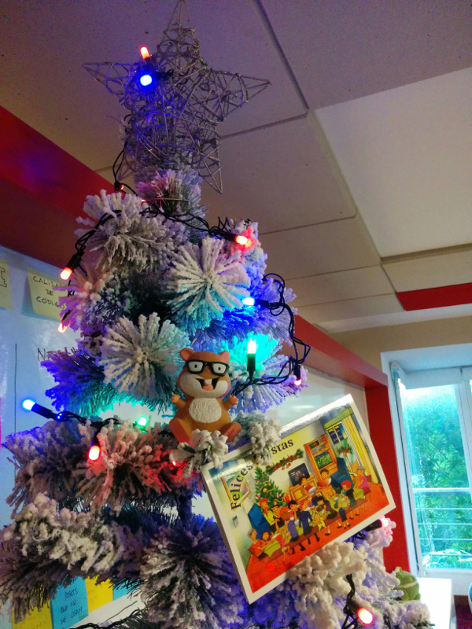

# Noviembre de 2015

* Fecha: 19 de noviembre de 2015
* Hora: de 19:30 a 22:00
* Participantes: 10

## Actividades

### Testing y dudas

Nos juntamos para ver testing en Ember en general y resolver dudas que trajo la
gente.

### Ember desde casi cero

Hicimos un workshop utilizando la app de ejemplo
[music](https://github.com/ember-montevideo/ember-spotify). Los requisitos son
mínimos: algún conocimiento sobre desarrollo web y un nivel principiante de
JavaScript.

## Recursos

## Participantes

* Adrián Mugnolo ([@xymbol](https://github.com/xymbol))
* Daniel Gomez ([@eldano](https://github.com/eldano))
* Fabián XXXX
* Gustavo Sequeira ([@tavofigse](https://github.com/tavofigse))
* Julio Barrios ([@jubar](https://github.com/jubar))
* Luis Ferreira ([@hidnasio](https://github.com/hidnasio))
* Marcos Bellucci ([@delbetu](https://github.com/delbetu))
* Pablo Suarez ([@PabloSuarez](https://github.com/PabloSuarez))
* Pablo Flores
* Santiago Ferreira ([@san650](https://github.com/san650))

## Agradecimiento

Agradecemos a [WyeWorks](https://wyeworks.com/) por brindarnos el lugar e
invitarnos las bebidas, los snacks y la cena.
