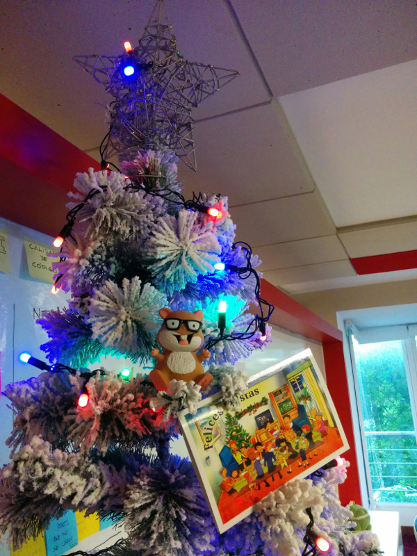

# Enero de 2016

* Fecha: 14 de enero de 2016
* Hora: de 19:30 a 22:00
* Participantes: 10

## Actividades

### Testing y dudas de proyectos

Nos juntamos para ver testing en Ember en general y resolver dudas que trajo la
gente.

## Recursos

...

## Participantes

* Adrián Mugnolo ([@xymbol](https://github.com/xymbol))
* Julio Barrios ([@jubar](https://github.com/jubar))
* Luis Ferreira ([@hidnasio](https://github.com/hidnasio))
* Santiago Ferreira ([@san650](https://github.com/san650))

## Agradecimiento

Agradecemos a [WyeWorks](https://wyeworks.com/) por brindarnos el lugar e
invitarnos las bebidas, los snacks y la cena.
