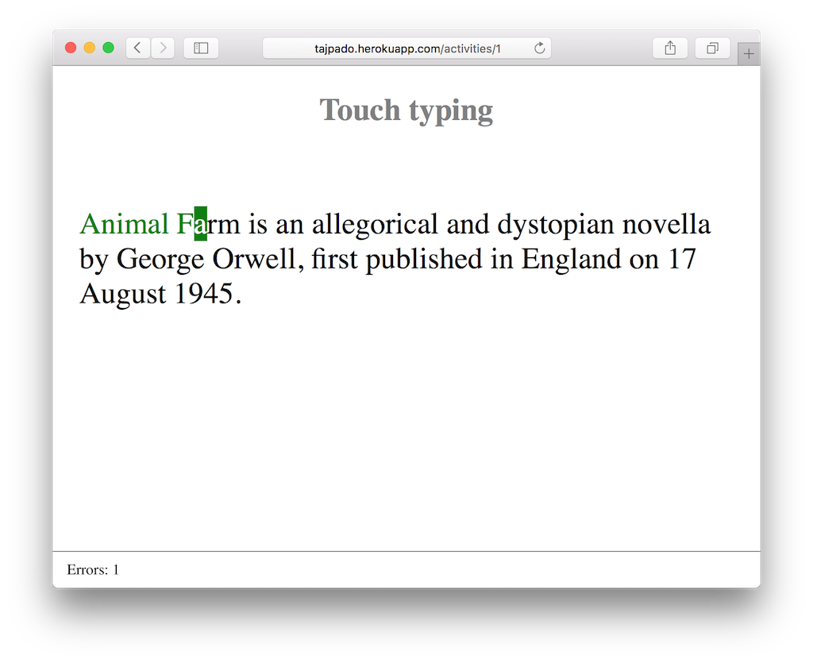

# Febrero de 2016

* Fecha: 11 de febrero de 2016
* Hora: de 19:30 a 22:00
* Participantes: 9

## Actividades

### Tajpado

Santiago nos mostró una aplicación para dactilografía construida con Ember.
Vimos la arquitectura de la aplicación, como se testeó y algunas funcionalidades
interesantes desde el punto de vista de la implementación.

## Recursos

* [Demo online de Tajpado](http://tajpado.herokuapp.com/)
* [Github del proyecto Tajpado](https://github.com/san650/tajpado)

## Participantes

* Adrián Mugnolo ([@xymbol](https://github.com/xymbol))
* Braulio Martinez ([@brauliomartinezlm](https://github.com/brauliomartinezlm))
* Fabian Rodriguez ([@fabianrbz](https://github.com/fabianrbz))
* Gustavo Villa ([@gfvcastro](https://github.com/gfvcastro))
* Julio Barrios ([@jubar](https://github.com/jubar))
* Luis Ferreira ([@hidnasio](https://github.com/hidnasio))
* Nicolás Barrera ([@drummerhead](https://github.com/drummerhead))
* Sandino Saso ([@sandinosaso](https://github.com/sandinosaso))
* Santiago Ferreira ([@san650](https://github.com/san650))

## Agradecimientos

Agradecemos a [WyeWorks](https://wyeworks.com/) por brindarnos el lugar e
invitarnos las bebidas, los snacks y la cena.
