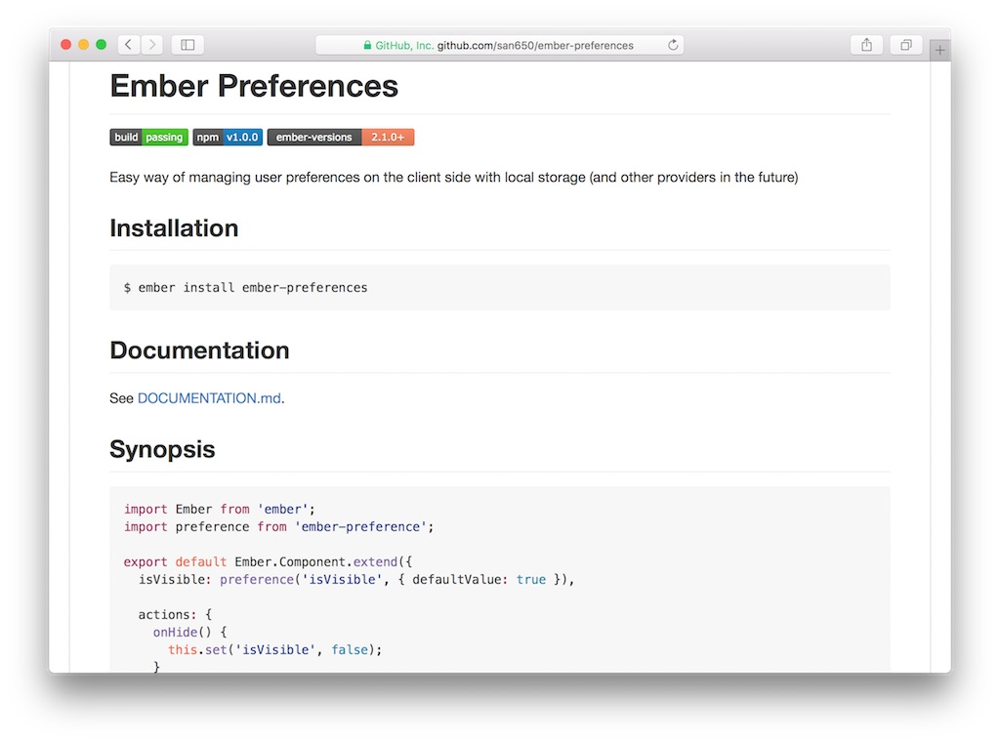

# Marzo de 2016

* Fecha: 10 de marzo de 2016
* Hora: de 19:30 a 22:00
* Participantes: 7

## Actividades

### ember-preferences

Santiago nos guió paso a paso en la construcción de una solución _cross
application_ para almacenar preferencias de usuarios. El resultado de lo que se
mostró luego se extrajo a un addon de ember-cli.

## Recursos

* [Ejercicio del meetup](https://github.com/ember-montevideo/ember-preferences-exercise)
* [ember-preferences addon](https://github.com/san650/ember-preferences#readme)

## Participantes

* Fabian Rodriguez ([@fabianrbz](https://github.com/fabianrbz))
* Mauricio Mena ([@lvlauricio](https://github.com/lvl4ul2i))
* Julio Barrios ([@jubar](https://github.com/jubar))
* Luis Ferreira ([@hidnasio](https://github.com/hidnasio))
* Santiago Ferreira ([@san650](https://github.com/san650))
* Gabriel Roldan ([@luisgabrielroldan](https://github.com/luisgabrielroldan))
* Sebastian Barcelona ([@sbarcelona11](https://github.com/sbarcelona11))

## Agradecimiento

Agradecemos a [WyeWorks](https://wyeworks.com/) por brindarnos el lugar e
invitarnos las bebidas, los snacks y la cena.
