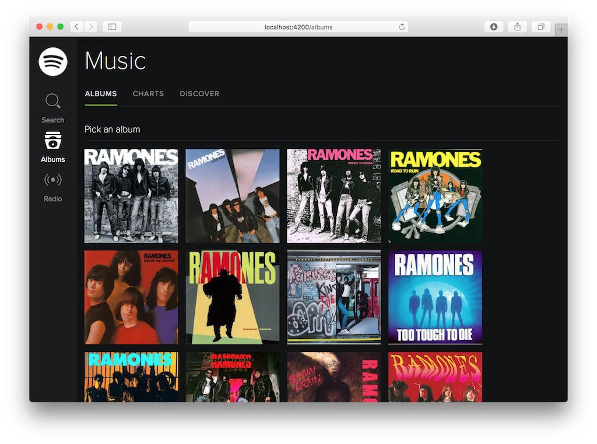

# Abril de 2016

* Fecha: 21 de abril de 2016
* Hora: de 19:30 a 22:00
* Participantes: 5

## Actividades

### Testeando Ember Music

Codificamos entre todos los tests para el Ember Music, un proyecto que surgió
del workshop de la JSConf 2015.

## Recursos

- [JSConf workshop](https://github.com/ember-montevideo/jsconf-uy-workshop) por Santiago y Adrián
- [Music API](https://github.com/ember-montevideo/music-api) por Santiago y Adrián
- [ember-cli-mirage](https://github.com/samselikoff/ember-cli-mirage)

## Participantes

* Adrián Mugnolo ([@xymbol](https://github.com/xymbol))
* Emilio Cristalli ([@EmilioCristalli](https://github.com/EmilioCristalli))
* Julio Barrios ([@jubar](https://github.com/jubar))
* Luis Ferreira ([@hidnasio](https://github.com/hidnasio))
* Santiago Ferreira ([@san650](https://github.com/san650))

## Agradecimientos

Agradecemos a [WyeWorks](https://wyeworks.com/) por brindarnos el lugar e
invitarnos las bebidas, los snacks y la cena.
