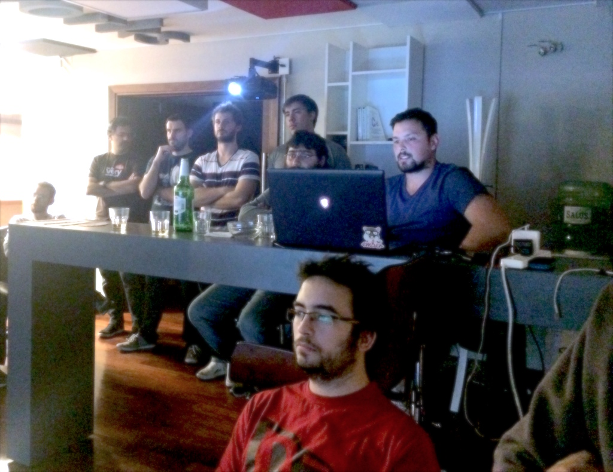

# Mayo de 2016

* Fecha: 12 de mayo de 2016
* Hora: de 19:30 a 22:00
* Participantes: 16

## Actividades

### Deploys en Ember

Marcelo Dominguez y Juan Azambuja van a contar sobre deployment con Ember CLI y
cómo notificar a los clientes de que una nueva versión está disponible.

### Linters, code conventions and continuous integration

Julio Barrios y Luis Ferreira van a presentar herramientas para mantener el
código limpio, validando que cumpla con estándares de codificación y tenga sus
dependencias al día. Luego vimos una configuración de continuous integration
para integrar todas estas buenas prácticas.

* [Slides](https://www.swipe.to/2495p#page=TTCQbRhJg)
* [Código](https://github.com/hidnasio/ember-montevideo-setup-demo) con paso a paso
* [.editorconfig](http://editorconfig.org/)
* [JSHint](http://jshint.com/)
* [JSCS](http://jscs.info/)
* [Ember Suave](https://github.com/DockYard/ember-suave)
* [ember-cli-template-lint](https://github.com/rwjblue/ember-cli-template-lint)
* [ember-cli-scss-lint](https://github.com/tomasbasham/ember-cli-scss-lint)
* [Heroku builpack para ember-cli](https://github.com/tonycoco/heroku-buildpack-ember-cli)
* [GitLab CI](http://docs.gitlab.com/ce/ci/quick_start/README.html)
* Se usó [Tajpado](https://github.com/san650/tajpado) como prueba de concepto.

### Novedades

Por último, retomamos la sección de novedades del mundo de Ember.

* Core
  * [Ember 2.5 Released](http://emberjs.com/blog/2016/04/11/ember-2-5-released.html)
  * [EmberConf 2016: The Future of Ember Templating by Godfrey Chan & Yehuda Katz](https://www.youtube.com/watch?v=dpx9P1cz37k&feature=youtu.be)
  * [fastboot](http://ember-fastboot.com/)
  * [Ember RFC #143: Module Unification](https://github.com/emberjs/rfcs/pull/143)
  * [ember-module-migrator](https://github.com/rwjblue/ember-module-migrator)

* Learning
  * [The Ember.js Times: Updates from the Ember.js Learning Team](https://the-emberjs-times.ongoodbits.com/2016/05/03/issue-1)
  * [Ember Rocks free ebook](http://www.ember.rocks/)
  * [16 Opensource EmberJS Projects to Learn From](https://www.icicletech.com/blog/16-opensource-emberjs-projects-to-learn-from)
  * [Creating Reusable Page Layouts in Ember](https://spin.atomicobject.com/2016/05/03/reusable-page-layouts-ember/)
  * [Using Ember Inspector with Testem](https://medium.com/@chrisdmasters/using-ember-inspector-with-testem-520a0bbbe708)
  * [Meaningful CSS: Style Like You Mean It](http://alistapart.com/article/meaningful-css-style-like-you-mean-it)

* Tools and addons
  * [Ember Hearth](http://ember.town/ember-hearth/)
  * [ember-cli-code-coverage](https://github.com/kategengler/ember-cli-code-coverage)

## Participantes

* Adrián Mugnolo ([@xymbol](https://github.com/xymbol))
* Emilio Cristalli ([@EmilioCristalli](https://github.com/EmilioCristalli))
* Fabian Silva ([@silvafab](https://github.com/silvafab))
* Fabián Larrañaga ([@FLarra](https://github.com/FLarra))
* Fabián Rodriguez ([@fabianrbz](https://github.com/fabianrbz))
* Federico Kauffman ([@fedekau](https://github.com/fedekau))
* Gabriel Roldan ([@luisgabrielroldan](https://github.com/luisgabrielroldan))
* Gustavo Villa ([@gfvcastro](https://github.com/gfvcastro))
* Jose Javier Señaris Carballo ([@pepesenaris](https://github.com/pepesenaris))
* Juan Azambuja ([@juanazam](https://github.com/juanazam))
* Julio Barrios ([@jubar](https://github.com/jubar))
* Luis Ferreira ([@hidnasio](https://github.com/hidnasio))
* Marcelo Dominguez ([@marpo60](https://github.com/marpo60))
* Martin Prado ([@Pirata21](https://github.com/Pirata21))
* Sandino Saso ([@sandinosaso](https://github.com/sandinosaso))
* Santiago Ferreira ([@san650](https://github.com/san650))

## Agradecimiento

Agradecemos a [WyeWorks](https://wyeworks.com/) por brindarnos el lugar e
invitarnos las bebidas, los snacks y la cena.
