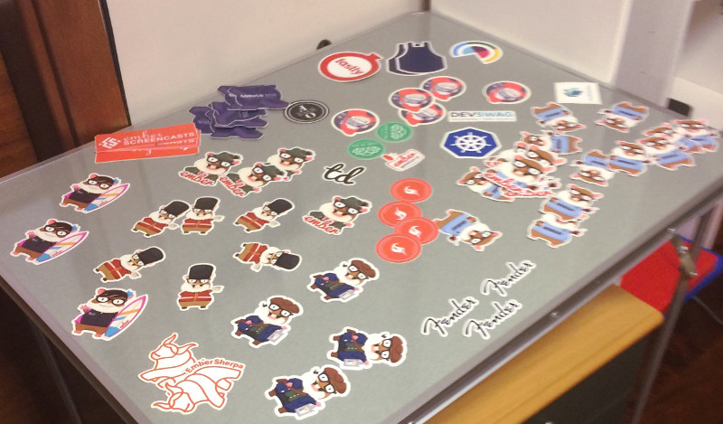

# Septiembre de 2016

* Fecha: 9 de septiembre de 2016
* Hora: de 19:30 a 22:00
* Participantes: 12

## Actividades

* web-sockets con Ember por *Federico*
* Contentful - a friendly CMS developer platform por *Julio*
* Juego "Flip the Tomster" por *Ignacio*
* telling-stories addon por *Santiago*
* ember-engines overview  por *Santiago*
* [offtopic] YubiKey por *Marcelo*

### Recursos

* [ember-websockets](https://github.com/thoov/ember-websockets)
* [Servicio contentful](https://www.contentful.com/)
* [filp-the-tomster github](https://github.com/hidnasio/flip-the-tomster)
* [telling-stories addon](https://github.com/mvdwg/telling-stories)
* [ember-engines github](https://github.com/dgeb/ember-engines)
* [Slides ember-engines overview](https://docs.google.com/presentation/d/1hVJmURqB5bkQ44QlHCgzR6vQXeyz9tNH9k0j0iaQ17k/edit?usp=sharing)
* [Yubico's YubiKey](https://www.yubico.com/products/yubikey-hardware/)

### Novedades

* Core
  * [Ember 2.8.0](https://github.com/emberjs/ember.js/releases/tag/v2.8.0)
  * [RFC: router enhancements](https://github.com/cibernox/rfcs/blob/router_enhancements/text/router-enhancements.md)
  * [Issue: reduce bite-size/file-count of ember-cli and its dep.](https://github.com/ember-cli/ember-cli/issues/6147)
  * [The Ember community's plans for Node.js LTS Support.](https://twitter.com/nathanhammond/status/773547812877283328)

* Learning
  * [To `attrs` or not to `attrs` - Ricardo Mendes (@locks)](https://locks.svbtle.com/to-attrs-or-not-to-attrs)
  * [Many-to-many relationships with Ember CLI Mirage](https://www.loadsys.com/many-many-relationships-ember-cli-mirage/)
  * [Lessons learned from four years with Ember - Ryan Toronto](https://blog.embermap.com/good-ember-developer-bad-ember-developer-7f9d52c6a0b5)
  * ["Let's build a drum machine" - Gavin Joyce](https://twitter.com/gavinjoyce/status/767853974179504128)
    * [Part1:](https://www.youtube.com/watch?v=dDPAUcxQ3lA)
    * [Part2:](https://www.youtube.com/watch?v=4vVWwYnICuY)
    * [Part3:](https://www.youtube.com/watch?v=6jR631ejVGI)
  * [Mixins considered harmful (in React framework)](https://facebook.github.io/react/blog/2016/07/13/mixins-considered-harmful.html)
  * [Automated Ember deployments - Adolfo Builes](https://envoy.engineering/automated-ember-deployments-492495f95dcd)
  * [ember-orbit en @EmberNYC - Dan Gebhardt](https://twitter.com/dgeb/status/769949697427529728)
  * [Testing Async in Ember.js — Part One](https://medium.com/@chrisdmasters/testing-async-in-ember-js-part-one-7ec9bc070c0e)
  * [Non-standard REST Actions in Ember Data](https://emberigniter.com/non-standard-rest-actions-ember-data/)

* Tools and addons
  * [ember-exam: new randomization iterator command](https://twitter.com/trentmwillis/status/764954976472883200)
  * [ember-inert-polyfill](https://twitter.com/Brian_Sipple/status/765381671495475200)
  * [slow-deps](https://twitter.com/nolanlawson/status/766275330403205122)
  * [ember-eline](https://davidpett.github.io/ember-eline/)

* Offtopic
  * [Hunting for great names in programming](https://m.signalvnoise.com/hunting-for-great-names-in-programming-16f624c8fc03#.emwn0drpm)
  * [React storybook](https://github.com/kadirahq/react-storybook/blob/master/README.md)
  * [The super tiny compiler](https://github.com/thejameskyle/the-super-tiny-compiler)
  * [HTTP/2 makes media loading 3-15 times faster on mobile](https://medium.com/apps-and-networking/http-2-makes-media-loading-3-15-times-faster-on-mobile-a455c3e68135)
  * [HTTP/2: 400gb of images per day](https://99designs.com/tech-blog/blog/2016/07/14/real-world-http-2-400gb-of-images-per-day/)
  * [Making sense of Redux](https://medium.freecodecamp.com/why-redux-makes-sense-to-me-and-how-i-conceptualize-it-c8a3a9db15ca)
  * [The cost of small modules](https://nolanlawson.com/2016/08/15/the-cost-of-small-modules/)
  * [The `target="_blank"` vulnerability by example](https://dev.to/ben/the-targetblank-vulnerability-by-example)
  * [requestAnimationFrame Scheduling For Nerds - Paul Irish](https://medium.com/@paul_irish/requestanimationframe-scheduling-for-nerds-9c57f7438ef4)
  * [Itsy bitsy data structures](https://github.com/thejameskyle/itsy-bitsy-data-structures/blob/9b63c28a72599ab6d3e42f24762063def7cbfd42/itsy-bitsy-data-structures.js)

## Participantes

* Daniel Gomez de Souza ([@eldano](https://github.com/eldano))
* Emilio Cristalli ([@EmilioCristalli](https://github.com/EmilioCristalli))
* Ernesto Cruz ([@ercpereda](https://github.com/ercpereda))
* Federico Kauffman ([@fedekau](https://github.com/fedekau))
* Gabriel Roldan ([@luisgabrielroldan](https://github.com/luisgabrielroldan))
* Jose Javier Señaris Carballo ([@pepesenaris](https://github.com/pepesenaris))
* Julio Barrios ([@jubar](https://github.com/jubar))
* Laura Santana Nuñez ([@laurasantana](https://github.com/laurasantana))
* Luis Ferreira ([@hidnasio](https://github.com/hidnasio))
* Marcelo Dominguez ([@marpo60](https://github.com/marpo60))
* Samanta de Barros ([@sdebarros](https://github.com/sdebarros))
* Santiago Ferreira ([@san650](https://github.com/san650))

## Agradecimientos

Agradecemos a [WyeWorks](https://wyeworks.com/) por brindarnos el lugar e
invitarnos las bebidas, los snacks y la cena.
