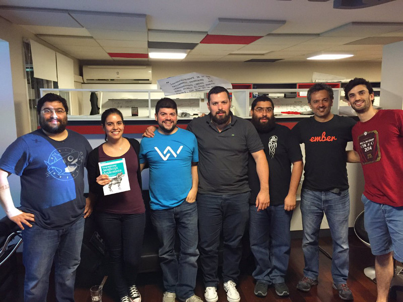

# Noviembre de 2016

* Fecha: 10 de noviembre de 2016
* Hora: de 19:30 a 22:00
* Participantes: 8

## Actividades

* ECMA Script Promises - Santiago
* Observables with Rx - Matías
* Progressive Web Applications with Ember - Santiago
* Nuevo addon ember-web-app - Santiago
* yarn - Santiago

### Recursos

* [Slides "ECMA Script Promises"](http://files.meetup.com/12641372/promises%20-%20walkthrough.pdf)
* [Slides "Observables with Rx"](http://files.meetup.com/12641372/Observables%20-%20Rx.pdf)
* [Slides "Progressive Web Applications with Ember"](http://files.meetup.com/12641372/Progressive%20Web%20Application%20with%20Ember.pdf)
* [ember-web-app](https://github.com/san650/ember-web-app)
* [web-app-manifest-validator](https://github.com/san650/web-app-manifest-validator)
* [yarn](https://yarnpkg.com/)

### Novedades

* Core
  * EMBER.JS 2.8-LTS, 2.9 and 2.10 beta released
    http://emberjs.com/blog/2016/10/17/ember-2-9-released.html
  * ember-cli 2.9.1
    https://github.com/ember-cli/ember-cli/releases/tag/v2.9.1
  * ember-engines with lazy loading support - Trent Willis
    https://twitter.com/trentmwillis/status/791061764905414656
  * So Ember Conference 2017 / - 27 Febrero. CFP 11 de Noviembre
    http://soember.com/
  * EmberConf 2017 / - 28 y 29 de Marzo. CFP 18 de Noviembre
    http://emberconf.com/
  * Focus on mobile performance isn't optional - @mixonic
    https://twitter.com/mixonic/status/790324055660388352

* Learning
  * Friendly URLs with slugs - Embermap
    https://embermap.com/video/friendly-urls-with-slugs
  * Building a sticky chatbox - Sam Selikoff
    https://blog.embermap.com/building-a-sticky-chatbox-3d50272c2e0c
  * Yelp clone with ember and redux - Toran Billups
    https://twitter.com/toranb/status/793085614715506688
  * Enemy of the state - State Management in Ember.js - Mike North
    https://www.youtube.com/watch?v=XYCCU53JdgM
  * The Ember Guide For Complete Beginners - Marten @martndemus
    https://martndemus.github.io/ember-guides-for-complete-beginners/
  * Ember Closure Actions in Depth - Miguel Camba
    http://miguelcamba.com/blog/2016/01/24/ember-closure-actions-in-depth/

* Tools and addons
  * ember-power-calendar - Miguel Camba
    http://www.ember-power-calendar.com/
  * ember-lifeline - Robert Jackson
    https://github.com/rwjblue/ember-lifeline#ember-lifeline
  * ember-responsive-image
    https://github.com/kaliber5/ember-responsive-image#ember-responsive-image
  * ember-web-animations-next-polyfill
    https://github.com/BrianSipple/ember-web-animations-next-polyfill#ember-web-animations-next-polyfill

* Offtopic
  * Node v7.0.0 (Current)
    https://nodejs.org/en/blog/release/v7.0.0/
  * Introducing the Web Share API
    https://developers.google.com/web/updates/2016/10/navigator-share
  * Intervening against document.write()
    https://developers.google.com/web/updates/2016/08/removing-document-write
  * Is Model-View-Controller dead on the front end?
    https://medium.freecodecamp.com/is-mvc-dead-for-the-frontend-35b4d1fe39ec

## Participantes

* Adrián Mugnolo ([@xymbol](https://github.com/xymbol))
* Alvaro Muhlethaler ([@amuhle](https://github.com/amuhle))
* Daniel Gomez de Souza ([@eldano](https://github.com/eldano))
* Julio Barrios ([@jubar](https://github.com/jubar))
* Luis Ferreira ([@hidnasio](https://github.com/hidnasio))
* Matías Delgado ([@matiasdelgado](https://github.com/matiasdelgado))
* Samanta de Barros ([@sdebarros](https://github.com/sdebarros))
* Santiago Ferreira ([@san650](https://github.com/san650))

## Agradecimientos

Agradecemos a [WyeWorks](https://wyeworks.com/) por brindarnos el lugar e
invitarnos las bebidas, los snacks y la cena.

Agradecemos a [UruIT](https://uruit.com/) por regalarnos un libro para sortear
en el meetup.
