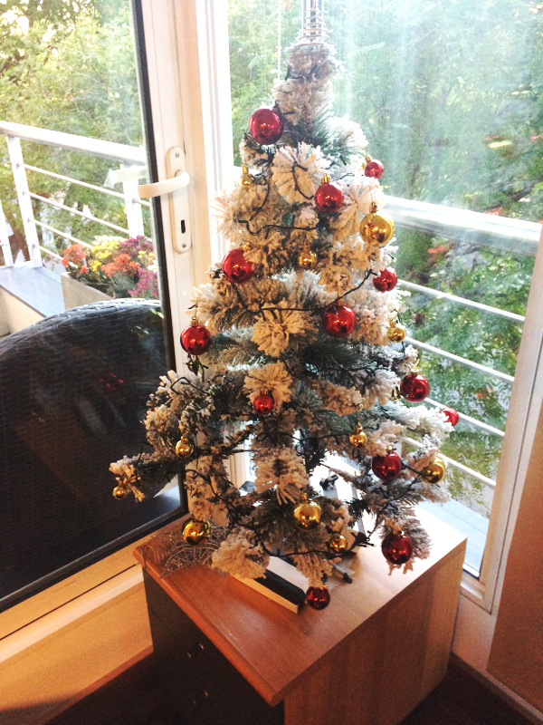

# Diciembre de 2016

* Fecha: 08 de diciembre de 2016
* Hora: de 19:30 a 22:00
* Participantes: 9

## Actividades

* ember-cli-fastboot - Juan
* Testing addons - Santiago
* 2016 in review - Santiago

### Recursos

* [2016 in Review](http://files.meetup.com/12641372/2016%20in%20review.pdf)
* [Slides "Testing Addons"](http://files.meetup.com/12641372/Testing%20addons%20-%20Ember%20Montevideo%20-%20Diciembre%202016.pdf)
* Proyecto de ejemplo [ember-humans-txt](https://github.com/san650/ember-humans-txt)

### Novedades

* Core
  * Ember 2.10 and 2.11 beta released
    http://emberjs.com/blog/2016/11/30/ember-2-10-released.html

* Learning
  * ember-engines.com - Trent Willis
    http://ember-engines.com/
  * Tomster and Travis, sitting in a tree: Ember at Travis CI
    https://blog.travis-ci.com/2016-11-28-ember-at-travis
  * Upgrade guide to Broccoli 1.0 - Jo Liss
    https://twitter.com/jo_liss/status/804457289297969152
  * Lockfiles should be commited on all projects - Jame Kyle
    https://yarnpkg.com/blog/2016/11/24/lockfiles-for-all

* Tools and addons
  * ember-required-properties - Echobind
    https://github.com/echobind/ember-required-properties
  * JSONAPI::Resources guides
    http://jsonapi-resources.com
  * date-fns
    https://twitter.com/silvenon/status/804946772690923520

* Offtopic
  * The road to native web components - Mike North
    https://mike.works/instructor/mike/talks/the-road-to-native-web-components-d50963f
  * Installing web apps on phones (for real)
    https://joreteg.com/blog/installing-web-apps-for-real
  * Custom elements that work anywhere - Rob Dodson
    https://medium.com/dev-channel/custom-elements-that-work-anywhere-898e1dd2bc48

## Participantes

* Daniel Gomez de Souza ([@eldano](https://github.com/eldano))
* Federico Kauffman ([@fedekau](https://github.com/fedekau))
* Gustavo Villa ([@gfvcastro](https://github.com/gfvcastro))
* Juan Azambuja ([@juanazam](https://github.com/juanazam))
* Julio Barrios ([@jubar](https://github.com/jubar))
* Luis Ferreira ([@hidnasio](https://github.com/hidnasio))
* Marcelo Dominguez ([@marpo60](https://github.com/marpo60))
* Samanta de Barros ([@sdebarros](https://github.com/sdebarros))
* Santiago Ferreira ([@san650](https://github.com/san650))

## Agradecimiento

Agradecemos a [WyeWorks](https://wyeworks.com/) por brindarnos el lugar e
invitarnos las bebidas, los snacks y la cena.
