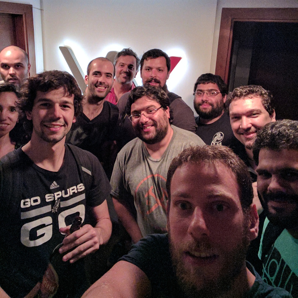

# Enero 2017

* Fecha: 12 de enero de 2017
* Hora: de 19:30 a 22:00
* Participantes: 11

## Actividades

* ember-service-worker-race - Federico
* ember-simon - Julio
* Whitespace: A different approach to javascript obfuscation - Marcelo
* move-the-boxes - Santiago

### Recursos

* [ember-service-worker-race repo](https://github.com/fedekau/ember-service-worker-race)
* [ember-simon repo](https://github.com/jubar/ember-simon)
* [DEFCON - Whitespace: A different approach to javascript obfuscation](http://www.securitytube.net/video/3670)
* [Move The Boxes game](http://move-the-boxes.pagefrontapp.com/)
* [move-the-boxes repo](https://github.com/san650/move-the-boxes)

### Novedades

* Core
  * Ember 2.10.2 & Ember 2.11.0-beta.3 released
    https://github.com/emberjs/ember.js/releases/
    http://emberjs.com/builds/
  * Security Incident - AWS S3 Access Key Exposure
    http://emberjs.com/blog/2016/12/14/security-incident-aws-s3-key-exposure.html

* Learning
  * How I learned to Stop Worrying and Love the Task - Vincent Bello
    https://engineering.linkedin.com/blog/2016/12/ember-concurrency--or--how-i-learned-to-stop-worrying-and-love-t
  * Ember Building Blocks - Balint Erdi
    https://s3-eu-west-1.amazonaws.com/rarwe-book/ember-building-blocks.pdf
  * Wicked Good Ember 2016 videos
    https://www.youtube.com/watch?v=GIa1ICukuMI&list=PLXOJZupxSq22zfW2KVnXFgLbu--DA7q0G
  * Ember Screen Casts free!
    https://twitter.com/JeffreyBiles/status/818234987644416000
  * What is an Engine? - Paul Abraham
    https://pusher.com/sessions/meetup/ember-london/ember-engines-at-scale

* Tools and addons
  * Ember Cli Mirage 0.3.0-beta.4 released
    http://www.ember-cli-mirage.com/blog/2017/01/09/0-3-0-beta-series/
  * ember-cli-tree-shake - @minichate
    https://github.com/minichate/ember-cli-tree-shake
  * ember-service-worker-race - Federico Kauffman
    https://github.com/fedekau/ember-service-worker-race
  * AST explorer might add support for Handlebars and Glimmer - Tobias Bieniek
    https://twitter.com/tobiasbieniek/status/819280994754850816
  * ember-humans-txt - Santiago Ferreira
    https://github.com/san650/ember-humans-txt
  * lebab.io
    https://lebab.io/

* Offtopic
  * Write Elm in your Ember.js app! - Jason Tu
    https://twitter.com/nucleartide/status/816381460852527104
  * Understanding different GC modes with Concurrency Visualizer
    https://blogs.msdn.microsoft.com/seteplia/2017/01/05/understanding-different-gc-modes-with-concurrency-visualizer/

## Participantes

* Adrián Mugnolo ([@xymbol](https://github.com/xymbol))
* Ernesto Cruz ([@ercpereda](https://github.com/ercpereda))
* Fabián Larrañaga ([@FLarra](https://github.com/FLarra))
* Federico Kauffman ([@fedekau](https://github.com/fedekau))
* Gabriel Roldan ([@luisgabrielroldan](https://github.com/luisgabrielroldan))
* Jose Javier Señaris Carballo ([@pepesenaris](https://github.com/pepesenaris))
* Julio Barrios ([@jubar](https://github.com/jubar))
* Laura Santana Nuñez ([@laurasantana](https://github.com/laurasantana))
* Luis Ferreira ([@hidnasio](https://github.com/hidnasio))
* Marcelo Dominguez ([@marpo60](https://github.com/marpo60))
* Santiago Ferreira ([@san650](https://github.com/san650))

## Agradecimiento

Agradecemos a [WyeWorks](https://wyeworks.com/) por brindarnos el lugar e
invitarnos las bebidas, los snacks y la cena.
