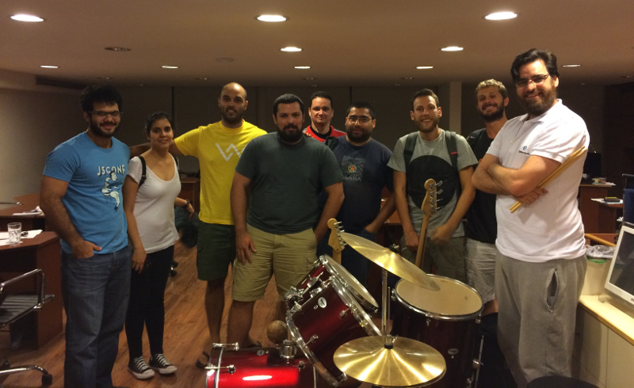

# Marzo 2017

* Fecha: 9 de Marzo de 2017
* Hora: de 19:30 a 22:00
* Participantes: 11

## Actividades

* Make your @emberjs acceptance tests to play as videos with telling-stories - Juan Azambuja 
* Going progressive with @emberjs - Samanta de Barros
* Using bluetooth from ember using ember-bluetooth - Federico Kauffman
* Latest ember news - Luis Ferreira

### Recursos

* [telling-stories ember addon](https://github.com/mvdwg/telling-stories)
* [ember-bluetooth ember addon by Federico Kauffman](https://github.com/wyeworks/ember-bluetooth)
* [ember-web-app ember addon by Santiago Ferreira](https://github.com/san650/ember-web-app)

### Novedades

* Core
  * ember v2.11.3 released!
    https://github.com/emberjs/ember.js/releases/tag/v2.11.3
  * 2017 Ember community survey
    http://emberjs.com/blog/2017/02/28/2017-ember-community-survey.html

* Learning
  * Test your EmberJS Addons - Nathan Hammond
    https://www.youtube.com/watch?v=IdTpNz_3Ec8
  * Intermediate Test Driven Development - Toran Billups
    http://toranbillups.com/blog/archive/2017/02/21/intermediate-test-driven-development/
  * Ember Server Side Rendering - Chris Watts
    https://www.youtube.com/watch?v=Xoi4HklCfh8
  * Riot using Ember.js + HTML + CSS for their UI - Ryan Tablada
    https://twitter.com/ryantablada/status/836415327185604610
  * Encapsulate Relationship Logic In Your Ember Data Model - David Tang
    http://thejsguy.com/2017/02/20/encapsulate-relationship-logic-in-your-ember-data-model.html
  * Journey through Ember.js Glue: Booting Up - Mike North
    https://twitter.com/michaellnorth/status/839610600032382976
  * How we test 200k lines Ember application in < 10 minutes. Again! - Mario Kostelac
    https://hackernoon.com/how-we-got-tests-for-200k-lines-ember-application-running-10-minutes-again-1fa7a4c5af2f#.ke4i49xlt
  * Class support for Mixins in TypeScript - Yehuda Katz
    https://twitter.com/wycats/status/834521571276382208
  * Electron & Ember.js
    https://twitter.com/bignerdranch/status/833477775902306304

* Tools and addons
  * Ember-bluetooth - Federico Kauffman
    https://github.com/wyeworks/ember-bluetooth
  * ember-component-respo - Michał Sajnóg
    https://github.com/michalsnik/ember-component-respo
  * Ember-bootstrap - Simon Ihmig
    https://twitter.com/simonihmig/status/836283028750073857

* Offtopic
  * A cartoon intro to WebAssembly - Lin Clark
    https://hacks.mozilla.org/2017/02/a-cartoon-intro-to-webassembly/
  * Build a successful open source project - Linus Torvalds
    https://www.linux.com/news/event/open-source-leadership-summit/2017/2/video-linus-torvalds-how-build-successful-open-source-project

## Participantes

* Eloísa da Silva ([@edasilva](https://github.com/edasilva))
* Ernesto Cruz ([@ercpereda](https://github.com/ercpereda))
* Federico Kauffman ([@fedekau](https://github.com/fedekau))
* Gabriel Chertok ([@cherta](https://github.com/cherta))
* Humberto Llauradó Falcó
* Juan Azambuja ([@juanazam](https://github.com/juanazam))
* Julio Barrios ([@jubar](https://github.com/jubar))
* Luis Ferreira ([@hidnasio](https://github.com/hidnasio))
* Marcelo Dominguez ([@marpo60](https://github.com/marpo60))
* Samanta de Barros ([@sdebarros](https://github.com/sdebarros))
* Santiago Ferreira ([@san650](https://github.com/san650))

## Agradecimientos

Agradecemos a [Ingenious Softworks](http://www.ingsw.com/) por brindarnos el lugar e
invitarnos las bebidas, los snacks y la cena.

Agradecemos a [WyeWorks](https://wyeworks.com/) por apoyarnos como sponsor.
