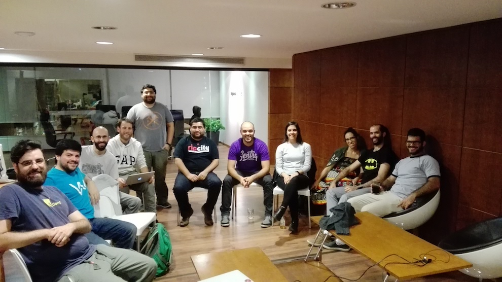

# Abril 2017

* Fecha: 18 de Abril de 2017
* Hora: de 19:30 a 22:00
* Participantes: 12

## Actividades

* Ember Montevideo App - Julio Barrios
* ☀️.js.uy - Santiago Ferreira
* Meetup Calendar in React - Gabriel Chertok 
* Latest ember news - Luis Ferreira
* Static site hostings - Marcelo Dominguez
* WYSIWYG catarsis - Federico Kauffman

### Recursos

* [Ember Montevideo App](https://github.com/jubar/ember-montevideo-app)
* [Meetup Calendar](https://github.com/js-uy/calendar)

### Novedades

* Core
  * [Ember 2.12.1 & Ember 2.13.0.beta2 released](https://github.com/emberjs/ember.js/releases/)
  * [EmberConf 2017: State of the Union - Tom Dale, Yehuda Katz, Godfrey Chan](https://emberjs.com/blog/2017/04/05/emberconf-2017-state-of-the-union.html)
  * [Ember Conf 2017 Videos](https://www.youtube.com/playlist?list=PL4eq2DPpyBbna_5fLPqOqensqSZpGf-hT)

* Learning
  * [Fixing memory leaks - Trent Willis](https://twitter.com/trentmwillis/status/852268718679773184)
  * [How Ember Observer searches addon source code - Michel S.](http://codeallday.com/blog/how-ember-observer-searches-addon-source-code/)
  * [Designing and Implementing Glimmer Like a Programming Language - Yehuda Katz](https://thefeedbackloop.xyz/designing-and-implementing-glimmer-like-a-programming-language/)
  * [App-like Scrolling and Transitions with Ember.js and Liquid Fire - Isaac Ezer](https://medium.com/@isaacezer/app-like-scrolling-and-transitions-with-ember-js-and-liquid-fire-bce2ad9a13ac)
  * [Our Path to Ember - Veli-Matti Luoto](https://blog.dockbit.com/our-path-to-ember-bd6ebbf0b94a)
  * [Refactoring Promise Patterns - Balint Erdi](https://balinterdi.com/blog/refactoring-promise-patterns/)
  * [Tool: glimmer-web-component - Library to boot up your Glimmer components as Web Components](https://github.com/glimmerjs/glimmer-web-component)
  * [Why I’m excited about GlimmerJS - Tristan Edwards](https://hackernoon.com/why-im-excited-about-glimmerjs-3631bd0c95c4)
  * [Ember Test Selector - EmberMap](https://embermap.com/video/ember-test-selectors)
  * [ember-redux - Toran Billups](https://twitter.com/toranb/status/851410184127860736)
  * [The Future of Ember’s Testing and the Beheading of jQuery - Miguel Camba](http://miguelcamba.com/blog/2017/04/11/the-future-of-embers-testing-and-the-beheading-of-jquery/)
  * [Deploying Glimmer Apps - Robert Jackson](http://rwjblue.com/2017/04/18/deploying-glimmer-apps/)

* Tools and addons
  * [Tool: A simple Ember wrapper for Stripe Elements - Josh Smith](https://github.com/code-corps/ember-stripe-elements)
  * [Tool: ember-web-workers - Service to communicate your application with browser web workers](https://github.com/BBVAEngineering/ember-web-workers)

* Offtopic
  * [Pacts to make with your team - Sarah Mei](https://twitter.com/lukemelia/status/847253099165003776)
  * [Choosing Ember over React in 2016 - Jesse Pollak](https://blog.instant2fa.com/choosing-ember-over-react-in-2016-41a2e7fd341)
  * [Interesting to see Ember actually becoming more Vue-like in terms of framework structuring - Evan You](https://twitter.com/youyuxi/status/850020636227391488)
  * [EmberCamp 2017 - London - CFP](https://cfp.embercamp.com/events/embercamp-ldn-2017)
  * [Progressive Web Apps - ILT](https://developers.google.com/web/ilt/pwa/)

## Participantes

* Daniel Gomez ([@eldano](https://github.com/eldano))
* Emilio Cristalli ([@EmilioCristalli](https://github.com/EmilioCristalli))
* Ernesto Cruz ([@ercpereda](https://github.com/ercpereda))
* Federico Kauffman ([@fedekau](https://github.com/fedekau))
* Gabriel Chertok ([@cherta](https://github.com/cherta))
* Jose Javier Señaris Carballo ([@pepesenaris](https://github.com/pepesenaris))
* Julio Barrios ([@jubar](https://github.com/jubar))
* Laura Santana Nuñez ([@laurasantana](https://github.com/laurasantana))
* Luis Ferreira ([@hidnasio](https://github.com/hidnasio))
* Marcelo Dominguez ([@marpo60](https://github.com/marpo60))
* Samanta de Barros ([@sdebarros](https://github.com/sdebarros))
* Santiago Ferreira ([@san650](https://github.com/san650))

## Agradecimientos

Agradecemos a [Ingenious Softworks](http://www.ingsw.com/) por brindarnos el lugar e
invitarnos las bebidas, los snacks y la cena.

Agradecemos a [WyeWorks](https://wyeworks.com/) por apoyarnos como sponsor.
