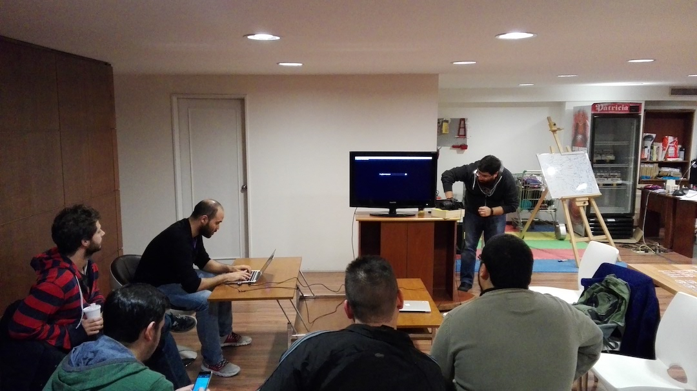

# Junio 2017

* Fecha: 5 de Junio de 2017
* Hora: de 19:30 a 21:30
* Participantes: 10

## Actividades

* Creating a custom WYSIWYG - Federico Kauffman
* Mirage 0.3 - Julio Barrios
* Noticias del mundo ember  - Luis Ferreira

### Recursos

* [Mirage 0.3](https://github.com/jubar/demo-mirage-03)

### Novedades

* Core
  * [Ember 2.13.3 and 2.14.0.beta.3 Released](https://github.com/emberjs/ember.js/releases)
  * [An interview with Tom Dale at EmberConf](https://twitter.com/heroku/status/861960845219254272)

* Learning
  * [Typing your Ember - Chris Krycho](https://twitter.com/chriskrycho/status/860443237210828800)
  * [Architecture CardStack - Edward Faulkner](https://twitter.com/eaf4/status/859767573507964929)
  * [Broccoli Debugging - Robert Jackson](https://jakearchibald.com/2016/sounds-fun/#musically-aware-scheduling)
  * [Search-first Web Applications - Edward Faulkner](http://eaf4.com/search-first-web-apps/)
  * [Pong game written in Glimmer.js - Illya Radchenko](https://twitter.com/knownasilya/status/863059420200267778)
  * [Maintainable User Interface Testing with Ember - Brian Sipple](https://emberway.io/maintainable-user-interface-testing-with-ember-40f1b58040b6)
  * [Batch Requests with Ruby on Rails and Ember.js - Netflix](https://medium.com/netflix-techblog/netflix-oss-batch-requests-with-ruby-on-rails-and-ember-js-4dfdd4b351da)
  * [Ember Route Hooks - A Complete Look - Alex DiLiberto](https://twitter.com/alex_diliberto/status/868610891381702656)

* Tools and addons
  * [ember-concurrency-decorators - Alex Matchneer](https://github.com/machty/ember-concurrency-decorators)
  * [redux-observable - Toran Billups](https://twitter.com/toranb/status/861539887845134337)
  * [ember-mobiledoc-editor addon](https://github.com/bustlelabs/ember-mobiledoc-editor)
  * [ember-links-with-follower addon](https://twitter.com/echobind/status/862711264652427264)
  * [ember-cli-prop-types addon](https://twitter.com/ev_rowe/status/865020880690098176)
  * [Ember Burger Menu 2.0](https://twitter.com/Offir_Golan/status/866759550463991808)
  * [ember-radical addon](https://healthsparq.github.io/ember-radical/)
  * [ember-scroll-preview addon](https://gowthamrm.github.io/ember-scroll-preview/)
  * [ember-apollo-client addon](https://frontsidethepodcast.simplecast.fm/69)

* Offtopic
  * [GitHub GraphQL API](https://developer.github.com/early-access/graphql/)
  * [Getting Started with Headless Chrome - Eric Bidelman](https://developers.google.com/web/updates/2017/04/headless-chrome)
  * [CSS and Markup in Javascript is an Evolutionary Dead End - Edward Faulkner](http://eaf4.com/evolutionary-dead-end/)
  * [Git Polishing - Robert Jackson](https://twitter.com/rwjblue/status/860495677486510080)

## Participantes

* Ernesto Cruz ([@ercpereda](https://github.com/ercpereda))
* Federico Kauffman ([@fedekau](https://github.com/fedekau))
* Gabriel Camargo ([@gab-cam](https://github.com/gab-cam))
* Humberto Llauradó Falcó [(@hllaurado)](https://github.com/hllaurado))
* Ignacio Martinez ([@imartinezingsw](https://github.com/imartinezingsw))
* Juan Azambuja ([@juanazam](https://github.com/juanazam))
* Julio Barrios ([@jubar](https://github.com/jubar))
* Luis Ferreira ([@hidnasio](https://github.com/hidnasio))
* Nicolás Torres ([@ntgussoni](https://github.com/ntgussoni))
* Santiago Ferreira ([@san650](https://github.com/san650))

## Agradecimientos

Agradecemos a [Ingenious Softworks](http://www.ingsw.com/) por brindarnos el lugar e
invitarnos las bebidas, los snacks y la cena.

Agradecemos a [WyeWorks](https://wyeworks.com/) por apoyarnos como sponsor.
