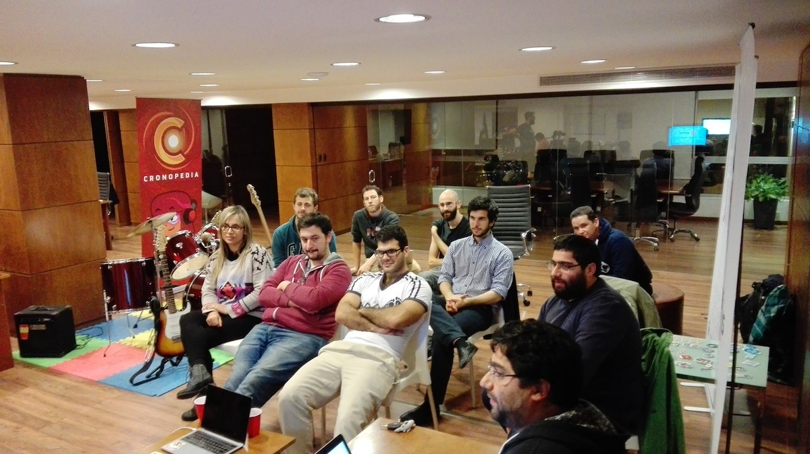

# Junio 2017

* Fecha: 3 de Julio de 2017
* Hora: de 19:30 a 22:00
* Participantes: 13

## Actividades

* Glimmer fast and lightweight UI components for the web - Santiago Ferreira
* github-compare-tags y ember-cli-diff - Marcelo Dominguez
* Noticias del mundo ember - Luis Ferreira

### Recursos

* [Glimmer reminders](https://github.com/san650/meetup-sample--glimmer-reminders)
* [github-compare-tags extension](https://github.com/marpo60/github-compare-tags)
* [ember-cli-diff app](https://github.com/mvdwg/ember-cli-diff)

### Novedades

* Cores
  * [Ember 2.13.3 & Ember 2.14.0.beta3 Released](https://github.com/emberjs/ember.js/releases)
  * [Ember CLI v2.13.3](https://twitter.com/twokul/status/879073857331646464)
  * [Fastboot incompatible addons list](https://github.com/ember-fastboot/ember-cli-fastboot/issues/387)
  * [GlimmerJS Rehydration](https://github.com/glimmerjs/glimmer-vm/pull/549)
  * [RFC for updating ember-qunit API for test unification](https://twitter.com/rwjblue/status/874836836698529793)

* Learning
  * [How to Build a Real Estate Website Using Ember.js](https://hackernoon.com/how-to-build-a-real-estate-website-using-ember-js-ef4ed7ae3806)
  * [Building a Progressive Web App with Ember](https://madhatted.com/2017/6/16/building-a-progressive-web-app-with-ember)
  * [Ember Simple Auth vs. Torii](http://willengler.com/ember-oauth2-1/)
  * [Angolia + GlimmerJS - Michael Schinis](https://twitter.com/mschinis/status/878208487762698240)
  * [ember-redux with TypeScript](https://twitter.com/toranb/status/874615589221871616)
  * [The Eight Ember Addons I Use On Every Project](https://medium.com/@lukedeniston/the-eight-ember-addons-i-use-on-every-project-8393bea3c96f)
  * [From Angular to Ember - David Tang](https://eng.verizondigitalmedia.com/2017/05/30/from-angular-to-ember/)

* Tools and addons
  * [ember-cli-diff.org](http://www.ember-cli-diff.org/)
  * [native-dom-helpers-codemod addon](https://twitter.com/simonihmig/status/870735003113672704)
  * [Glimmer Playground](http://glimmer-playground.netlify.com/)
  * [broccoli-concat-analyser](https://github.com/stefanpenner/broccoli-concat-analyser)
  * [Mirage v0.3.3](https://twitter.com/samselikoff/status/871868122764128260)
  * [ember-cli-prerender addon](https://github.com/Motokaptia/ember-cli-prerender)
  * [ember-classnames addon](https://twitter.com/cryrivers/status/869037505995194368)
  * [Time input Ember Addon](https://twitter.com/davidjbilling1/status/879367748035522560)
  * [Ember CLI Sassdash addon](https://github.com/willviles/ember-cli-sassdash)
  * [Ember Burger Menu v3.0.0](https://twitter.com/offir_golan/status/879464724785577988)
  * [ember-router-service-polyfill addon](https://twitter.com/rwjblue/status/879842764094976000)
  * [Improve your Ember debugging experience with CrhomeDevTools formatters for EmberJS](https://twitter.com/dwickern/status/880943428569243648)
  * [ember-socket-guru](https://twitter.com/jacek_bandura/status/881501232531218432)
  * [July 2017 Glimmer Web Component update - Sam Selikoff](https://twitter.com/samselikoff/status/881283879344250880)

* Offtopic
  * [Customer Convo: Dan Gebhardt, Cerebris](https://twitter.com/npmjs/status/881200742551486466)
  * [Apple overhauls iTunes website](https://9to5mac.com/2017/06/06/apple-music-preview-website/)aiqw q cv

## Participantes

* Eloísa da Silva ([@edasilva](https://github.com/edasilva))
* Ernesto Cruz ([@ercpereda](https://github.com/ercpereda))
* Emilio Cristalli ([@EmilioCristalli](https://github.com/EmilioCristalli))
* Gabriel Chertok ([@cherta](https://github.com/cherta))
* Humberto Llauradó Falcó [(@hllaurado)](https://github.com/hllaurado))
* Juan Azambuja ([@juanazam](https://github.com/juanazam))
* Julio Barrios ([@jubar](https://github.com/jubar))
* Luis Ferreira ([@hidnasio](https://github.com/hidnasio))
* Marcelo Dominguez ([@marpo60](https://github.com/marpo60))
* Nicolás Torres ([@ntgussoni](https://github.com/ntgussoni))
* Santiago Ferreira ([@san650](https://github.com/san650))

## Agradecimientos

Agradecemos a [Ingenious Softworks](http://www.ingsw.com/) por brindarnos el lugar e
invitarnos las bebidas, los snacks y la cena.

Agradecemos a [WyeWorks](https://wyeworks.com/) por apoyarnos como sponsor.
