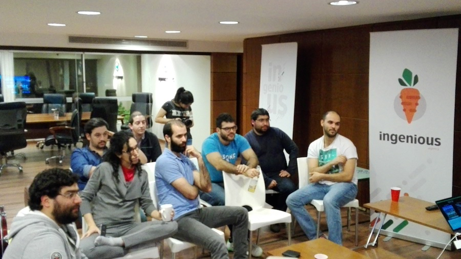

# Agosto 2017

* Fecha: 7 de Julio de 2017
* Hora: de 19:30 a 22:00
* Participantes: XX

## Actividades

* Building Comunities - Gabriel Chertok
* Elige tu propia aventura - Santiago Ferreira
* Noticias del mundo ember - Luis Ferreira

### Recursos
* [Diapositivas de la charla Building Comunities](https://www.slideshare.net/cherta/building-communities-78791307)

### Novedades

* Cores
  * [Ember 2.14 & 2.15 beta released](https://emberjs.com/blog/2017/07/06/ember-2-14-released.html)
  * [Ember Fastboot 1.0 released](https://emberjs.com/blog/2017/07/19/ember-fastboot-1-0-release.html)
  * [Useful stack traces when using QUnit + Ember - Stefan Penner](https://twitter.com/stefanpenner/status/888065452374544384)
  * [EmberCamp Module Unification Update - Matthew Beale](https://madhatted.com/2017/7/12/embercamp-module-unification-update)
  * [Named Blocks RFC](https://twitter.com/machty/status/886924546372231168)
* Learning
  * [Using headless Chrome instead of PhantomJS for Ember testing - Ryan Toronto](https://embermap.com/notes/59-ember-tests-with-headless-chrome)
  * [Setting up Testem - Chrome headless in Jenkins - Abhilash L R](https://medium.com/@abhilashlr/setting-up-testem-chrome-headless-in-jenkins-332af4328ece)
  * [orbitjs.com launched - Dan Gebhardt](https://twitter.com/dgeb/status/887094551084769280)
  * [How to build a Progressive Web App with Ember - Marten Schilstra](https://dockyard.com/blog/2017/07/20/how-to-build-a-pwa-with-ember)
  * [Debugging Broccoli and Ember-CLI - Martin Feckie](https://mfeckie.github.io/Debugging-Broccoli-And-Ember/)
  * [Why use ember redux? - Toran Billups](https://twitter.com/toranb/status/893076201631252480)
  * [olo.com dropped thier CI time by half by updating from Ember 2.6 to 2.14](https://twitter.com/jasonlaster11/status/893515564265746432)
* Tools and addons
  * [ember-cli-diff.org has a new look and feel](https://twitter.com/marpo60/status/888566167354343424)
  * [ember-cli-diff.org new look and feel (2)](https://twitter.com/marpo60/status/888566167354343424)
  * [ember-cli-eslint v4.2.0 released](https://twitter.com/TobiasBieniek/status/887785120459104256)
  * [Extension pack for visual studio code for installling Ember addons](https://twitter.com/_tsauer/status/885853391439753220)
  * [ember-font-awesome seek help for supporting Font Awesome 5](https://twitter.com/buschtoens/status/882625940181975040)
  * [ember-flatpickr v2.0.0 released](https://twitter.com/shipshapecode/status/887695060535521281)
  * [Ember Freestyle v0.6.0 released](https://twitter.com/chrislopresto/status/884197023410421760)
  * [ember-web-app v2.0.0 released](https://twitter.com/san650/status/883688728308404229)
  * [ember-light-table v1.9.0 released](https://twitter.com/buschtoens/status/883232564328230912)
  * [ember-route-task-helper addon](https://twitter.com/buschtoens/status/893975508333056000)
  * [ember-appmetrics addon](https://github.com/gokatz/ember-appmetrics)
  * [ember-collect-helper addon](https://twitter.com/buschtoens/status/887654047410520065)
  * [eslint-plugin-ember addon](https://github.com/ember-cli/eslint-plugin-ember)
  * [ember-cli-updater addon](https://github.com/mvdwg/ember-cli-updater)
* Offtopic
  * [Announcing Meteor 1.5 - Ben Newman](https://blog.meteor.com/announcing-meteor-1-5-b82be66571bb)
  * [F# for C# programmers - Scott Wlaschin](https://twitter.com/ScottWlaschin/status/882678520132120577)

## Participantes

* Ernesto Cruz ([@ercpereda](https://github.com/ercpereda))
* Federico Kauffman ([@fedekau](https://github.com/fedekau))
* Gabriel Chertok ([@cherta](https://github.com/cherta))
* Julio Barrios ([@jubar](https://github.com/jubar))
* Luis Ferreira ([@hidnasio](https://github.com/hidnasio))
* Nicolás Torres ([@ntgussoni](https://github.com/ntgussoni))
* Santiago Ferreira ([@san650](https://github.com/san650))
* Sebastian Grillo

## Agradecimientos

Agradecemos a [Ingenious Softworks](http://www.ingsw.com/) por brindarnos el lugar e
invitarnos las bebidas, los snacks y la cena.

Agradecemos a [WyeWorks](https://wyeworks.com/) por apoyarnos como sponsor.
